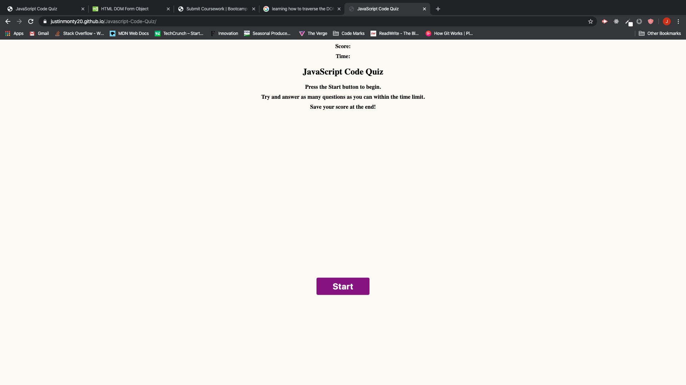
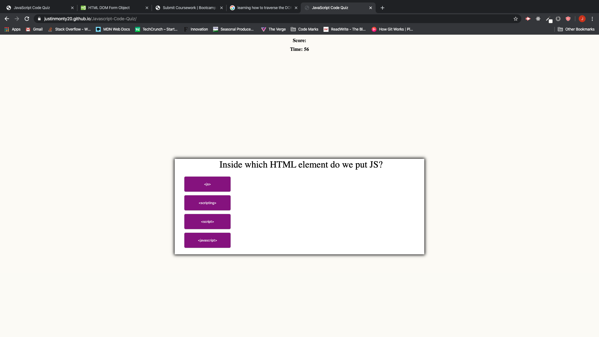

JavaScript Code Quiz.

1. Opens up to the main page of the Quiz with instructions and a start button.

2. When the start button is clicked then the first question is generated on the page and a timer at the top of the screen begins. 

3. Timer counts down and you select your answer choices. Clicking on an answer choice will tell you if you are right or wrong. and then load the next question.

4. If you are wrong then you lose five seconds of your time.  If you are correct you don't lose anytime and you feel happy. 

5. When you reach the last question and answer it then your score is however much time was left on the counter. 

6. A form field is supposed to pop up where you can enter your initals and set the high score. 

Here is the link to my deployed site on GitHub Pages
https://justinmonty20.github.io/Javascript-Code-Quiz/